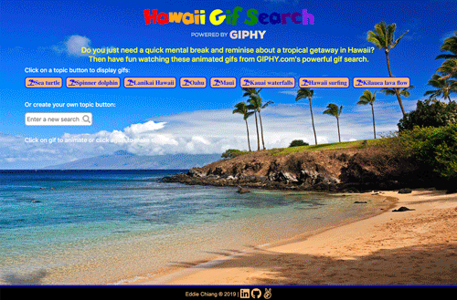

# GIPHY API - Hawaii

Do you just need a quick mental break and reminisce about a tropical getaway in Hawaii? Then have fun watching these animated gifs from GIPHY.com's powerful gif search.  This web application is powered by GIPHY application program interface (API) to incorporate GIPHY's vast library.  The app is fully mobile responsive for learning on the go.

## App Interface
Instructions:
* Click on the preset buttons to retrieve 10 Hawaii theme gifs.
* Click on the non-animated gif images to animate, click again to stop the animation.
* Alternatively, Go crazy and input any terms you want to search and click on the search icon.
* Make sure you turn up your volume to enjoy the music (not compatible with Chrome).

Click on the link to play!
https://echiang73.github.io/GifTastic/

## Built with
* HTML5
* CSS3
* JavaScript
* Bootstrap
* jQuery
* API AJAX
* Responsive Web Design Media Query
* Form input Font Awesome image and use of pseudocodes

### Here are the previews of the game:

